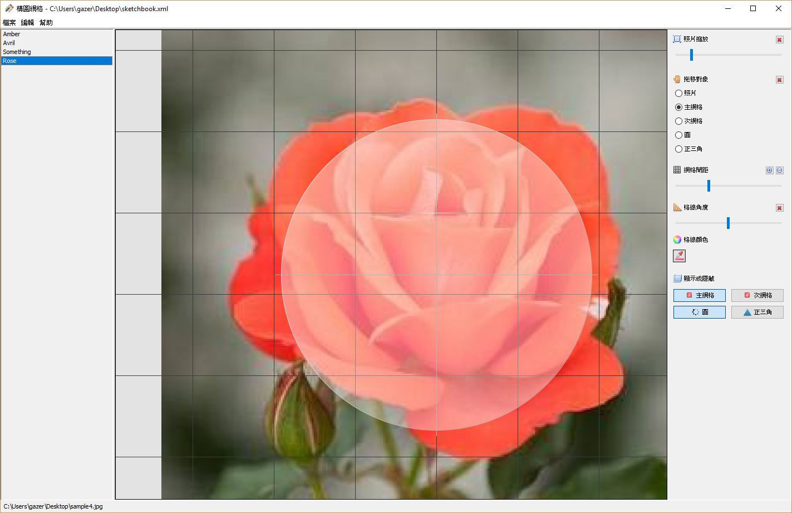

# 構圖網格

| [Home](http://gazer2kanlin.github.io/uia.sketch4j/)
| [English](readme_en.md)
|

此工具可幫助業餘繪圖愛好者(例如我自己)，利用虛擬格線的套疊，增加構圖時的準確性。

目前有的格線：

* 正方形
* 圓形
* 正三角形

## 功能

* 多重套疊

* 可自定義格線顏色

* 可調整格線間距與角度

* 可利用鍵盤調整格線間距與角度

* 可利用鍵盤調整照片大小

## 截圖

### 雙正方形

### 雙正方形

### 圓形 & 正方形

### 正三角形

## 版權和許可證

Licensed under the Apache License, Version 2.0 (the "License");
you may not use this file except in compliance with the License.
You may obtain a copy of the License at

[http://www.apache.org/licenses/LICENSE-2.0](http://www.apache.org/licenses/LICENSE-2.0)

Unless required by applicable law or agreed to in writing, software
distributed under the License is distributed on an "AS IS" BASIS,
WITHOUT WARRANTIES OR CONDITIONS OF ANY KIND, either express or implied.
See the License for the specific language governing permissions and
limitations under the License.
