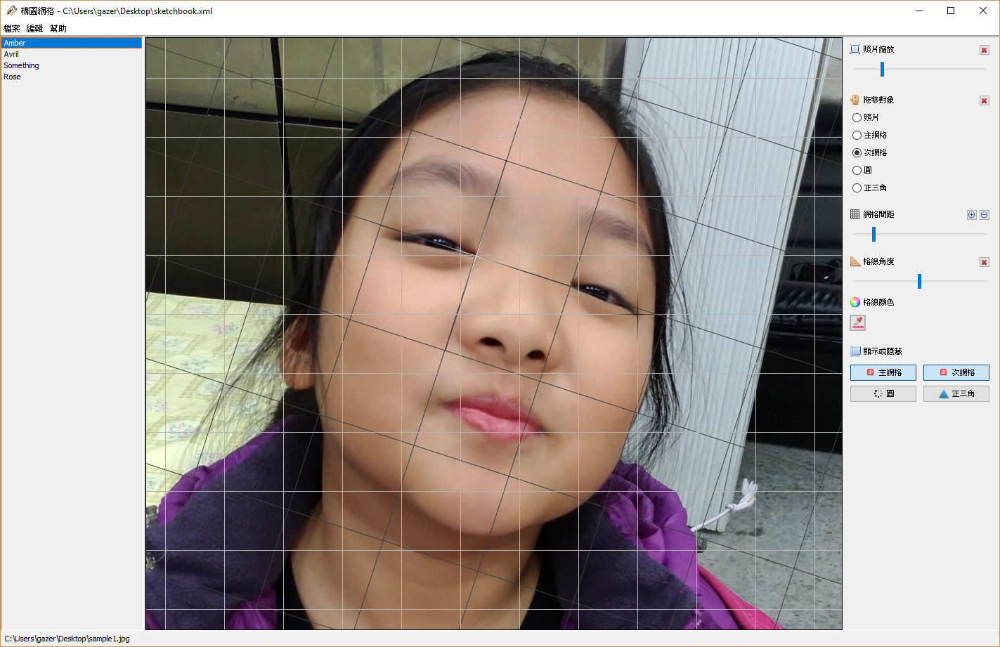
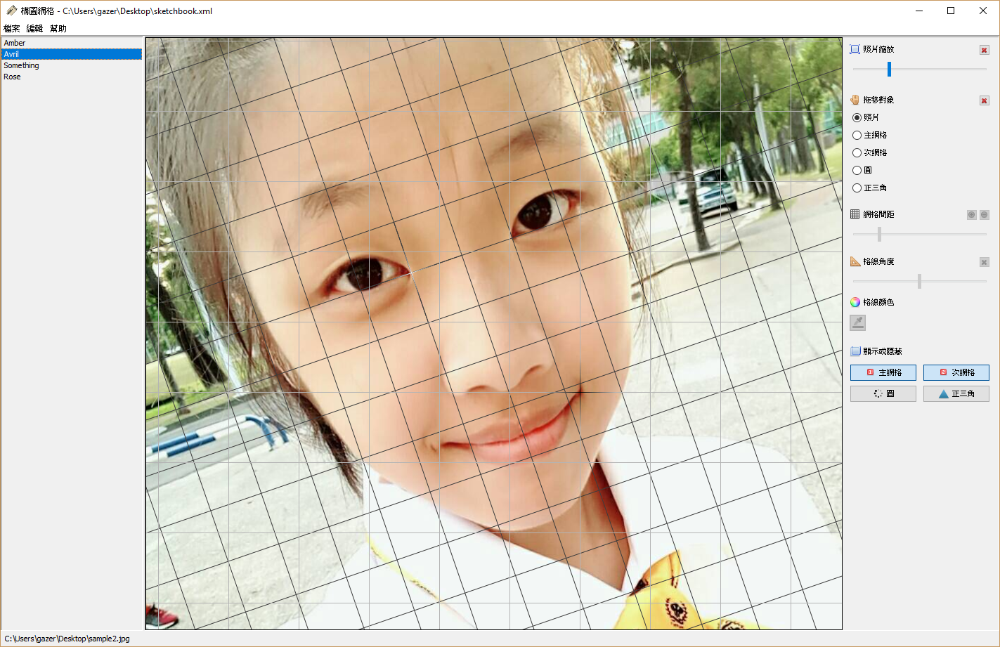

# 素描鏡框 (Sketch Glasses)

此工具程式利用虛擬網格線條，輔助業餘素描愛好者(例如我自己)，在構圖時增加準確性。

## Features

* 雙網格套疊

* 可自定義網格顏色

* 可調整網格間距與角度

* 可利用鍵盤調整照片大小

* 可利用鍵盤調整網格間距與角度

## Screenshots

## Copyright and License

Licensed under the Apache License, Version 2.0 (the "License");
you may not use this file except in compliance with the License.
You may obtain a copy of the License at

[http://www.apache.org/licenses/LICENSE-2.0](http://www.apache.org/licenses/LICENSE-2.0)

Unless required by applicable law or agreed to in writing, software
distributed under the License is distributed on an "AS IS" BASIS,
WITHOUT WARRANTIES OR CONDITIONS OF ANY KIND, either express or implied.
See the License for the specific language governing permissions and
limitations under the License.
